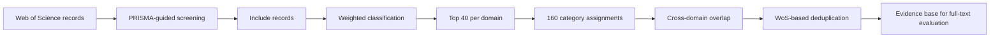

# Digital Viticulture Evidence Mapping

A reproducible Python workflow for PRISMA-guided screening, weighted
thematic classification and cross-domain evidence mapping in digital
and precision viticulture.

The workflow was developed for the systematic review:

**Integrated Digital Ecosystems for Precision Viticulture: A Systematic
Review of Multisource Sensing, AI-Based Modelling and Decision-Support
Systems**

## Overview

The notebook implements a semi-automated evidence-mapping procedure for
identifying and prioritizing publications relevant to digital and
precision viticulture.

Titles and abstracts are screened and scored using weighted vocabularies
representing four complementary technological domains:

1. Artificial Intelligence and Machine Learning
2. Sensor and Spectral Technologies
3. Digital and Precision Viticulture
4. Digital Technologies and Decision Support

For each domain, the 40 highest-scoring records meeting the minimum
relevance threshold are retained. Cross-domain overlap is quantified
using unique Web of Science identifiers, and duplicate assignments are
resolved according to the strongest thematic score.

## Workflow

## Cross-domain overlap

The Top-40 selection generated 160 category assignments across the four
technological domains. Deduplication based on unique Web of Science
identifiers produced 152 unique publications, with eight duplicated
category assignments corresponding to a 5.0% cross-domain overlap.

  

  <em>Cross-domain overlap among the four technological domains included
  in the weighted evidence-mapping framework.</em>

The diagonal cells represent the 40 publications retained within each
domain. Off-diagonal cells show shared publications, revealing the
strongest intersections between AI and sensing technologies and between
precision viticulture and decision-support infrastructures.
