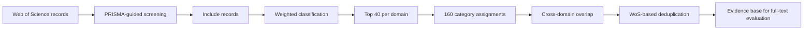
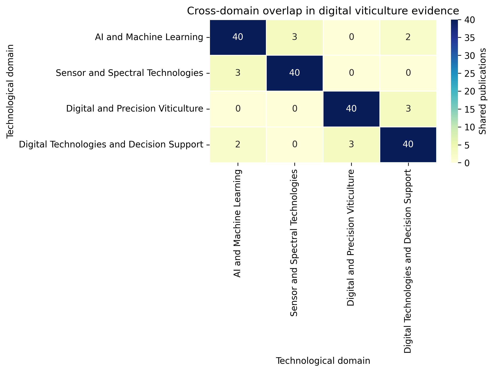

# Digital Viticulture Evidence Mapping

A reproducible Python workflow for PRISMA-guided screening, weighted
thematic classification and cross-domain evidence mapping in digital
and precision viticulture.

The workflow was developed for the systematic review:

**Integrated Digital Ecosystems for Precision Viticulture: A Systematic
Review of Multisource Sensing, AI-Based Modelling and Decision-Support
Systems**

## Overview

The notebook implements a semi-automated evidence-mapping procedure for
identifying and prioritizing publications relevant to digital and
precision viticulture.

Titles and abstracts are screened and scored using weighted vocabularies
representing four complementary technological domains:

1. Artificial Intelligence and Machine Learning
2. Sensor and Spectral Technologies
3. Digital and Precision Viticulture
4. Digital Technologies and Decision Support

For each domain, the 40 highest-scoring records meeting the minimum
relevance threshold are retained. Cross-domain overlap is quantified
using unique Web of Science identifiers, and duplicate assignments are
resolved according to the strongest thematic score.

## Workflow


## Repository structure

```text
digital-viticulture-evidence-mapping/
├── README.md
├── final_code.ipynb
├── input_schema.csv
├── cross_domain_overlap.png
├── requirements.txt
└── LICENSE
```

## Cross-domain overlap

The Top-40 selection generated 160 category assignments across the four
technological domains. Deduplication based on unique Web of Science
identifiers produced 152 unique publications, with eight duplicated
category assignments corresponding to a 5.0% cross-domain overlap.

<p align="center">
  
</p>

<p align="center">
  <em>Cross-domain overlap among the four technological domains included
  in the weighted evidence-mapping framework.</em>
</p>

The diagonal cells represent the 40 publications retained within each
domain. Off-diagonal cells show shared publications, revealing the
strongest intersections between AI and sensing technologies and between
precision viticulture and decision-support infrastructures.

## Input data

The notebook expects a CSV file containing Web of Science bibliographic
records with, at minimum, the following columns:

- `Article Title`
- `Abstract`
- `UT (Unique ID)`

The following alternative identifier fields are also recognized:

- `UT`
- `WOS`
- `Accession Number`

The original `wos_records.csv` file is not included because it contains
licensed bibliographic content exported from Web of Science. Users must
obtain the source records through authorized institutional access.

The repository includes `input_schema.csv`, a synthetic example showing
the minimum structure required by the notebook. This example is intended
only to document the input format and does not reproduce the numerical
results reported in the associated systematic review.

## Main parameters

The final analysis uses:

```python
top_n = 40
min_score = 5
```

## Running the workflow

The notebook was developed and tested in Google Colab.

Download or clone this repository.
Open final_code.ipynb in Google Colab.
Mount Google Drive when prompted.
Update the input and output paths if necessary.
Run the notebook cells sequentially.

## Outputs

The workflow generates:
screening decisions for all bibliographic records;
weighted scores for each technological domain;
Top-40 selections for the four domains;
a pairwise cross-domain overlap matrix;
a WoS-ID-based deduplicated evidence set;
category-level summary tables;
Excel and text exports;
the cross-domain overlap heatmap.
Methodological scope

The notebook reproduces the automated stages of the evidence-mapping
workflow, including title–abstract screening, weighted thematic
classification, Top-40 prioritization, cross-domain overlap analysis and
WoS-based deduplication.

Full-text evaluation of quantitative performance, field validation and
technological maturity was conducted as a subsequent evidence-synthesis
stage and is not derived solely from the automated classification.

## Software requirements

The workflow requires Python 3 and the following packages:

pandas
numpy
openpyxl
matplotlib
seaborn

Required packages and minimum versions are listed in
requirements.txt.

## Data and code availability

The Python code, weighted thematic vocabularies and derived
non-proprietary outputs are publicly available in this repository.
Licensed Web of Science abstracts and complete bibliographic exports are
not redistributed.

## Citation

If you use or adapt this workflow, please cite the associated systematic
review and the archived Zenodo release.

A permanent DOI will be added after the first GitHub release is archived
in Zenodo.

## License

The source code is distributed under the MIT License. See LICENSE for
details.


